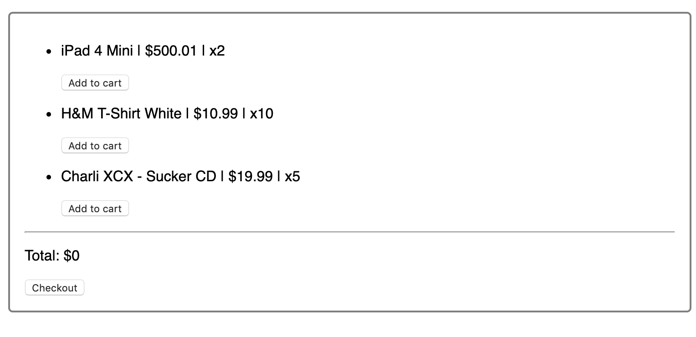
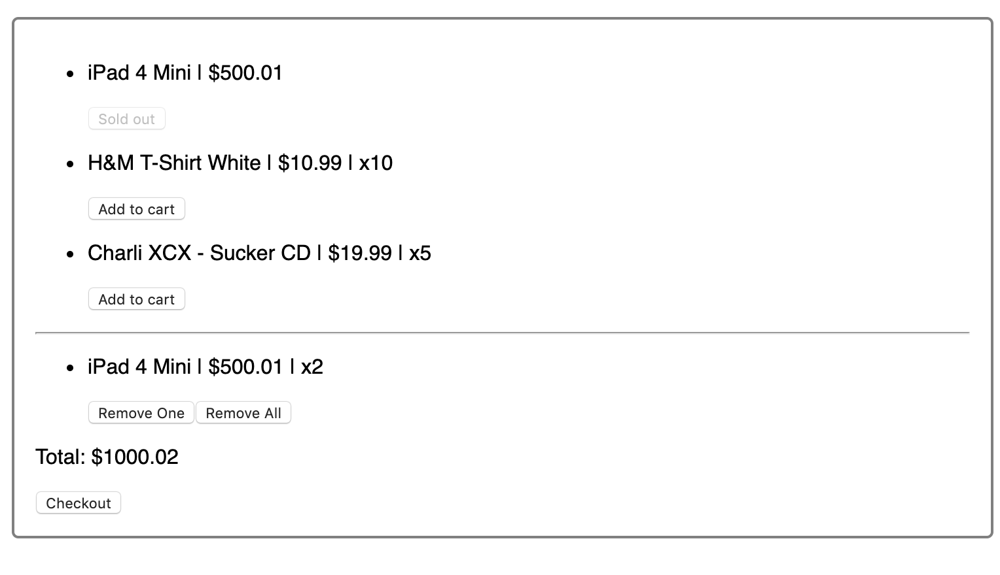

## Instructions for students:

### Create a Shopping Cart

- The user should see a Product List of items with: - Description of the product - Price - Quantity available (inventory).
- The user should be able to add items to the Shopping Cart until the quantity available is sold out.
- The user should be able to see the Shopping Cart at all times.
- The user should be able to remove one item or remove all items from the Shopping Cart and the item or items will be returned to the Product List of items.
- The total amount should be updated every time you add or remove an item.
- Once the user clicks the checkout button the items will be removed from the Shopping Cart, the total amount will go back to 0 and the main Product List of items will show the current amount of items available after the last purchase.
- Make sure to use components _Examples of components: ProductList, ProdListItem, ShoppingCart, ShopCartItem._
-   Use Create React App
-   Use Redux

-   Images for reference:
    
    

-   Use this list of items, saved them as a JSON file:

```JSON
[
  {"id": 1, "title": "iPad 4 Mini", "price": 500.01, "inventory": 2},
  {"id": 2, "title": "H&M T-Shirt White", "price": 10.99, "inventory": 10},
  {"id": 3, "title": "Charli XCX - Sucker CD", "price": 19.99, "inventory": 5}
]
```

**Bonuses**

-   Make you own list of items
-   Add more product items
-   Add images to your items

### Rules

-   This is an individual assignment.
-   Deadline: 2 days
-   Use **Git properly**
-   Feel free to document your code with comments.
